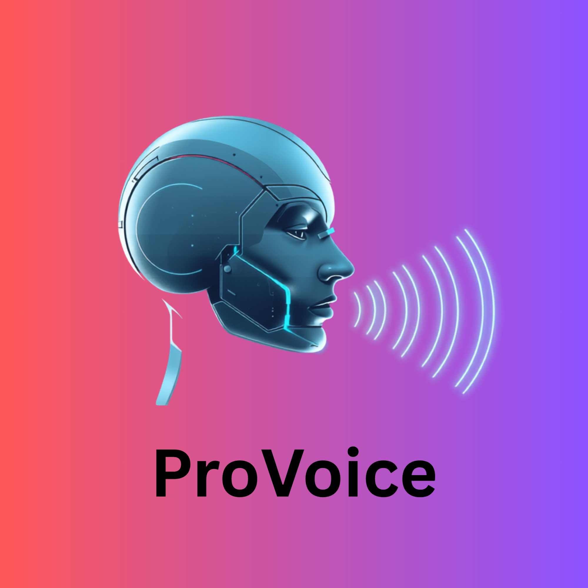

# ProVoice - AI Native Voice Mimicer. in Native Language.

    <picture>
        
    </picture>

**ProVoice** is a `Voice Analyizer` and is `Mimicer` the same voice of character in that `VIDEO`. in a video with `auto-dubbed` (feature in `YouTube` implemented by `Google`). to native language in native voice communication.

NoLong MachineVoice like AutoDubbing :-
--------------------------------------

* Is Makes Life easier. with real communcation.
* this feacture more useful native voice communication with Natural Language Processing by specified Language.

***Danger*** with this feature :-
==================================
-> by this works like micing exactly human voice. and is MisUse Propablity is High. Do not Worry about that.

-> This is Only work on allowed Video. Which are Granded Permission from Intelligent Video Analyizing model. rather than API KEYS.

-> This mostly coming. with Small AI model with there Intelligence.

